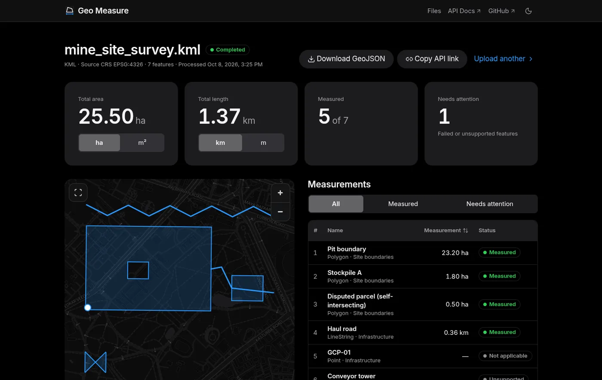
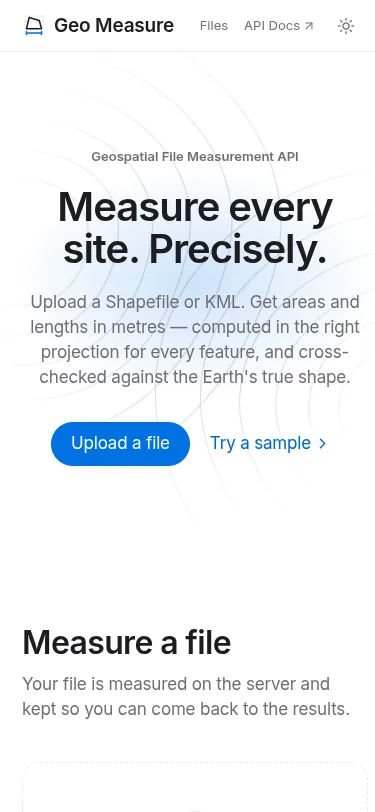
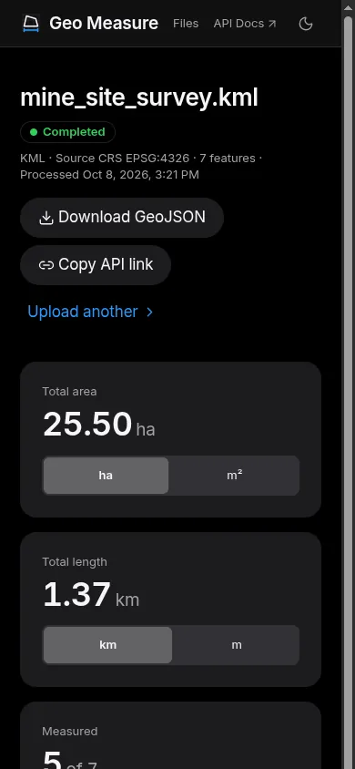
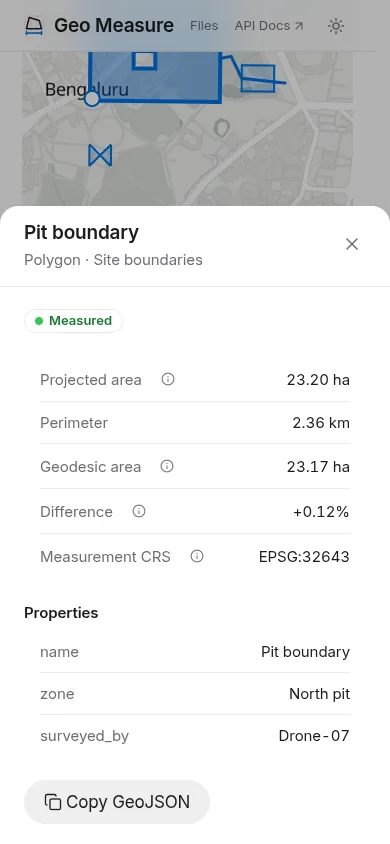
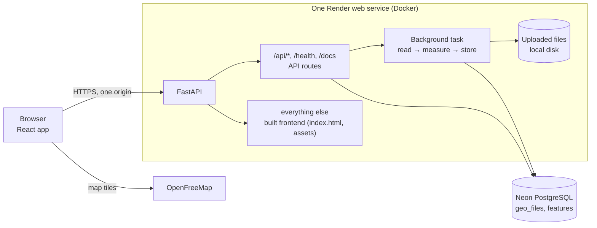
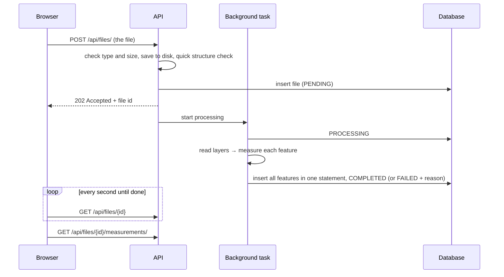
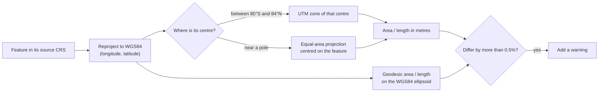

<p align="center">
  
</p>

<h1 align="center">Geospatial File Measurement API</h1>

<p align="center">
  Upload a Shapefile or KML and get the true area and length of every feature, in metres.
</p>

<p align="center">
  <a href="https://github.com/srinivas-rc0408/geospatial-measurement-api/actions/workflows/backend.yml"></a>
  <a href="https://github.com/srinivas-rc0408/geospatial-measurement-api/actions/workflows/frontend.yml"></a>
  <a href="#testing"></a>
  <a href="LICENSE"></a>
</p>

<p align="center">
  <b><a href="https://geo-measure-api.onrender.com">Live demo</a></b> ·
  <a href="https://geo-measure-api.onrender.com/docs">API docs</a> ·
  <a href="backend/README.md">Backend deep dive</a>
</p>

> The demo runs on free hosting that sleeps when idle, so the first visit can take up to a minute to wake up.
> After that it is fast. Click **Try a sample** to see results without preparing a file.



<p align="center">
  
  
  
</p>

<details>
<summary>Upload → results in 13 seconds (animated)</summary>


</details>

## Contents

[What is this?](#what-is-this) · [Features](#features) · [Quick start](#quick-start) · [How it works](#how-it-works) ·
[API](#api) · [Tech stack](#tech-stack) · [Testing](#testing) · [Design decisions](#design-decisions) ·
[Deployment](#deployment) · [Project structure](#project-structure) · [Limitations](#limitations) ·
[Learnings](#learnings) · [Future scope](#future-scope) · [Glossary](#glossary) · [Author](#author)

## What is this?

Drones and surveyors map sites such as mines, solar farms and construction plots. Their maps are saved in
**geospatial files**: a **Shapefile** (a set of files, usually shared as one `.zip`) or a **KML** file (the format
Google Earth uses; `.kmz` is a zipped KML). Each file holds **features**: a pit outline (a polygon), a haul road (a
line), a survey marker (a point), each with its own attributes.

The obvious question is "how big is it?". Answering it is harder than it looks, because map coordinates are
usually **degrees** of latitude and longitude, not metres. A degree of longitude is 111 km wide at the equator and
0 km at the poles, so area "in degrees" means nothing. Even maps that *are* in metres can mislead: the common web
map projection, **Web Mercator**, stretches everything away from the equator. A square that measures
1,000 × 1,000 "metres" in Web Mercator near Bengaluru really covers **944,917 m²**, about 6% less than the
1,000,000 m² its coordinates suggest. At 60° north the naive figure would be four times too large.

This app takes your file, reads every feature, moves each one into a map projection made for measuring that exact
spot (its local **UTM zone**), and reports area for polygons and length for lines, in metres. It checks every result
against a second, independent calculation on the Earth's true shape and flags any disagreement.

## Features

- **Shapefile (.zip), KML and KMZ**, including multiple layers, KML folders and `.prj` files in any CRS.
- **Area** for polygons (holes subtracted), **length** for lines, **perimeter** for polygons; points are listed
  without a measurement.
- **Per-feature UTM zone**, so sites that cross a zone boundary stay accurate; an equal-area projection near the poles.
- **Geodesic cross-check** on the WGS84 ellipsoid, with a warning when the two values differ by more than 0.5%.
- **Self-intersecting polygons repaired** before measuring, and the repair is noted on the feature.
- **One bad feature never fails the file**: each feature gets its own status and reason.
- **Safe uploads**: size limits, ZIP-bomb, zip-slip and XML-entity (XXE) protection.
- **Web interface**: drag-and-drop upload with live progress, a map, sortable results, feature details,
  file history, dark and light themes, phone to desktop.
- **JSON API** with interactive docs, a typed OpenAPI contract and GeoJSON export.

## Quick start

### Run the whole site with Docker

```bash
git clone https://github.com/srinivas-rc0408/geospatial-measurement-api.git
cd geospatial-measurement-api
docker build -t geo-measure . && docker run --rm -p 8000:8000 geo-measure
```

Open **http://localhost:8000** for the app and **http://localhost:8000/docs** for the API. The container uses a
SQLite database inside the container and creates its tables on start.

### Local development (hot reload)

Requirements: Python 3.11+ and Node.js 24. No GDAL or other system libraries are needed.

```bash
# Terminal 1: the API on http://localhost:8000
cd backend
python -m venv .venv && source .venv/bin/activate     # Windows: .venv\Scripts\activate
pip install -r requirements-dev.txt
alembic upgrade head                                  # creates ./data/geo.db (SQLite)
uvicorn app.main:create_app --factory --reload

# Terminal 2: the web app on http://localhost:5173 (calls the API through Vite's proxy)
cd frontend
npm ci
npm run dev
```

Using PostgreSQL instead of SQLite is described in [backend/README.md](backend/README.md#using-postgresql--neon).

## How it works

### Architecture



The browser loads the page and calls the API from the same address, so there is nothing to configure between them.
The backend keeps its layers separate: `api/` handles HTTP only, `services/readers/` turn any file format into plain
features, `services/measurement.py` and `crs.py` measure them, and `services/processor.py` runs the pipeline and owns
the status. More in [docs/ARCHITECTURE.md](docs/ARCHITECTURE.md).

### Processing flow



A bad file is refused at once with a clear reason (`415` unsupported type, `413` too large, `422` broken). A file
that looks fine but fails while being read ends as `FAILED` with a readable `error`. If the server restarts mid-job,
the job is marked `FAILED` on start-up instead of staying "processing" forever.

### Measurement flow



### CRS handling, in simple words

- A **CRS** says what the numbers in a file mean: degrees on the globe, or metres on some flat map.
- The app **always** moves every feature into a projection chosen for measuring it, even if the file is already "in
  metres", because some metre-based projections (like Web Mercator) distort distances badly.
- It picks the **UTM zone** under the feature's centre: inside a zone, a metre on the map is within 0.1% of a metre
  on the ground. Near the poles, where UTM is not defined, it uses an equal-area projection centred on the feature.
- It also measures directly on the curved Earth (**geodesic**) and compares. On the samples the two agree to within
  0.12%.
- A Shapefile without a `.prj` has no CRS. If every coordinate fits in longitude/latitude bounds it is read as
  WGS84 with a warning; otherwise the features are not measured, because guessing a projection could be badly wrong.

The full reasoning, with numbers and edge cases, is in [backend/README.md → CRS handling](backend/README.md#crs-handling).

## API

| Method | Path | What it does |
|---|---|---|
| `POST` | `/api/files/` | Upload a `.zip` (Shapefile), `.kml` or `.kmz`; returns `202` and the file id |
| `GET` | `/api/files/` | List uploaded files, newest first (paginated) |
| `GET` | `/api/files/{id}` | File info: name, type, status, CRS, feature count, bounding box, totals |
| `GET` | `/api/files/{id}/features/` | Extracted features: geometry, CRS, attributes (paginated, filterable) |
| `GET` | `/api/files/{id}/measurements/` | Area, length, perimeter, geodesic values and status per feature, plus a summary |
| `GET` | `/api/files/{id}/geojson/` | Everything as one GeoJSON file (EPSG:4326) |
| `DELETE` | `/api/files/{id}` | Delete a file and its results |
| `GET` | `/api/config` | Upload size limit and accepted extensions |
| `GET` | `/health`, `/health/ready` | Liveness (no database), readiness (checks the database) |

Example with the mine site sample:

```bash
curl -F "file=@backend/sample_data/mine_site_survey.kml" http://localhost:8000/api/files/
# 202 {"id": "70e0054d19bc409a9f8a8d2f1ae7416a", "status": "PENDING", ...}

curl http://localhost:8000/api/files/70e0054d19bc409a9f8a8d2f1ae7416a/measurements/?limit=1
```

```json
{
  "summary": {
    "total_area_m2": 255000.291,
    "total_area_hectares": 25.500029,
    "total_length_m": 1370.02,
    "total_length_km": 1.37002,
    "by_status": { "MEASURED": 5, "NOT_APPLICABLE": 1, "UNSUPPORTED": 1, "FAILED": 0 }
  },
  "total": 7,
  "items": [
    {
      "feature_id": 0,
      "layer": "Site boundaries",
      "geometry_type": "Polygon",
      "status": "MEASURED",
      "measurement_crs": "EPSG:32643",
      "area_m2": 232000.35,
      "area_hectares": 23.200035,
      "perimeter_m": 2360.002,
      "geodesic": { "area_m2": 231731.912, "length_m": null },
      "messages": []
    }
  ]
}
```

Every endpoint, with request and response examples and all error cases, is in
[docs/API_CONTRACT.md](docs/API_CONTRACT.md) and [backend/README.md → API](backend/README.md#api). The running app
serves interactive docs at `/docs`.

## Tech stack

| Layer | Choice | Why |
|---|---|---|
| API | **FastAPI** (Python 3.12) | Typed request and response models, automatic OpenAPI docs, background tasks built in |
| Geometry | **shapely 2, pyproj 3, pyshp, defusedxml** | Install from wheels on any OS (no GDAL); each step is explicit and testable; defusedxml blocks XML attacks |
| Database | **PostgreSQL on Neon** (production), **SQLite** (local, tests) | Same code and migrations on both; Neon scales to zero when idle |
| Data access | **SQLAlchemy 2 + Alembic**, psycopg 3 | Typed models; versioned migrations instead of creating tables at start-up |
| Web app | **React 19 + TypeScript + Vite** | A single-page app is enough: no server rendering needed for a tool behind a JSON API |
| Styling | **Tailwind CSS 4** with design tokens | One set of colour, type and spacing tokens for both themes |
| Server state | **TanStack Query** | Polling, caching and retries without hand-written state machines |
| API types | **openapi-typescript + openapi-fetch** | Frontend types are generated from the backend's OpenAPI, never written by hand |
| Map | **MapLibre GL** + OpenFreeMap tiles | Open-source vector maps with no API key; loaded only on the results page |
| Hosting | **Render** (one Docker service) + **Neon** | Free tiers; one URL for the site and the API |

## Testing

| Suite | What it covers | Result |
|---|---|---|
| Backend (`pytest`) | Measurement accuracy, CRS handling, readers, security, API, migrations, frontend serving | **122 tests**, pass on SQLite and PostgreSQL 17; **94%** line coverage (combined) |
| Frontend (`vitest`) | Upload flow, validation, results, history, formatting, accessibility behaviour | **132 tests** in 24 files; 80% line coverage |
| End to end (Playwright) | Real UI against a real backend: the three samples' numbers, counts and statuses | **3 tests** |
| Lighthouse (production image) | Home: mobile / desktop | Performance **94 / 100**, Accessibility **100**, Best practices **100**, SEO **100**, CLS 0 |
| | Results page: mobile / desktop | Performance **90 / 68–89**, Accessibility **100**, Best practices **100**, SEO **100**, CLS 0 |

Examples of what the tests prove: a 1 km² square measures 1,000,000 m² (±1e-6); the Web Mercator square measures
944,917 m², not 1,000,000; a self-intersecting "bow tie" is repaired to two triangles of 5,000 m²; a polar polygon is
within 0.01% of its geodesic area; a ZIP bomb, zip-slip path and XXE entity are all rejected; migrations build exactly
the models' schema; features are inserted in a single statement.

```bash
cd backend && pytest                       # add GEO_TEST_DATABASE_URL=postgresql+psycopg://… to run on PostgreSQL
cd frontend && npm run lint && npm run typecheck && npm run test && npm run build
cd frontend && npm run test:e2e            # needs the backend running (see frontend/README.md)
```

CI runs the backend suite on Python 3.11, 3.12 and 3.13 (SQLite) and on a PostgreSQL 17 service container, the
frontend checks, and builds both Docker images.

## Design decisions

| Decision | Chosen | Alternatives considered | Why |
|---|---|---|---|
| Framework | FastAPI | Django + DRF | Typed schemas and OpenAPI for free; a two-table service needs no admin or ORM-heavy stack |
| Projection | Per-feature UTM (equal-area near poles) | One CRS per file; geodesic only | Accurate area *and* length everywhere; the geodesic value stays as an independent check |
| Source CRS | Always reproject | Trust files already in metres | "In metres" is not "safe to measure in" (Web Mercator) |
| Bad geometry | Repair and warn, per feature | Reject the file; measure as-is | Keeps the data and tells the user; one bad feature never fails the file |
| Processing | Background task, `202 Accepted` | Synchronous; Celery + Redis | No extra infrastructure; the status lifecycle already matches a real queue |
| Geo libraries | shapely + pyproj + pyshp | GeoPandas / GDAL | Pure wheels, simple install, explicit steps |
| JSON columns | Plain `json` | `jsonb` | `jsonb` reorders keys; attribute order is what users see |
| Health checks | `/health` without database, `/health/ready` with | One health check that queries the database | Render's frequent checks would otherwise keep Neon awake all month |
| Hosting | One Docker service serving site and API | Vercel + Render | One URL, no CORS, no build-time URLs; the cost is a whole-site cold start |
| Upload limits | Served by `GET /api/config` | Constants in the frontend | One source of truth |

Each decision, with its context and consequences, is in [docs/DECISIONS.md](docs/DECISIONS.md).

## Deployment

One **Render** web service serves both the web app and the API from one URL ([`render.yaml`](render.yaml)). The root
[`Dockerfile`](Dockerfile) builds the frontend in a Node stage, then copies the build into the Python API image, which
serves it next to `/api` with long-lived caching for hashed assets and gzip compression. The database is **Neon
PostgreSQL** in the same region (Singapore); the container runs `alembic upgrade head` when it starts.

Values to enter when creating the Render Blueprint:

| Variable | Value |
|---|---|
| `GEO_DATABASE_URL` | Neon **pooled** connection string |
| `GEO_MIGRATIONS_DATABASE_URL` | Neon **direct** connection string |
| `GEO_PUBLIC_URL` | `https://geo-measure-api.onrender.com` (absolute link-preview URLs) |

The free instance sleeps after 15 minutes without traffic. To keep it awake during a review, point an uptime pinger at
`/health` every ~10 minutes; that endpoint never touches the database, so Neon still scales to zero.
`backend/Dockerfile` is an API-only image for running the backend on its own.

## Project structure

```
.
├── Dockerfile, render.yaml       # the deployed image (frontend + API) and its Render Blueprint
├── backend/                      # FastAPI service
│   ├── app/
│   │   ├── api/                  # HTTP only: files, config, health, frontend serving
│   │   ├── services/             # processor, measurement, CRS selection, readers/ (Shapefile, KML/KMZ)
│   │   ├── models.py, schemas.py # database tables, API shapes
│   │   └── config.py, main.py    # settings (GEO_*), app factory
│   ├── migrations/               # Alembic
│   ├── tests/                    # pytest; inputs built in memory by factories.py
│   ├── sample_data/              # the three samples plus a broken one
│   └── Dockerfile, openapi.json  # API-only image, committed OpenAPI snapshot
├── frontend/                     # React app
│   ├── src/
│   │   ├── pages/                # Home, Results, Files, NotFound
│   │   ├── features/             # home, upload, results (map, table, sheet), history
│   │   ├── components/ui/        # design-system primitives
│   │   └── lib/                  # typed API client, query hooks, formatting, theme
│   ├── e2e/                      # Playwright accuracy tests
│   └── public/samples/           # samples offered by "Try a sample"
├── docs/                         # architecture, API contract, design system, decision log, images
└── .github/workflows/            # backend, frontend and Docker CI
```

## Limitations

- **Free hosting sleeps.** The first visit after 15 idle minutes waits about a minute for the whole site.
- **In-process background tasks.** A restart interrupts running jobs (they are marked `FAILED`, not lost silently),
  and work cannot be spread across machines.
- **Uploaded files live on the container's disk**, which Render's free tier does not keep across deploys. The
  measurements in the database survive; the original files do not.
- **No accounts.** Every visitor sees every uploaded file.
- **Antimeridian.** A feature crossing ±180° longitude gets the wrong UTM zone. Rare for site-scale data.
- **2D only.** Areas are flat (planimetric); terrain surface area and volumes need an elevation model.
- **KMZ:** only the main `doc.kml` is read; network links are not followed.
- **Results page on desktop:** loading the map library costs 0.5–2 s of script time, so its Lighthouse
  Performance score varies between 68 and 89.

<!-- Srinivas: review and rewrite in your own words -->
## Learnings

- **A test that counts SQL statements caught a silent slowdown.** I switched feature inserts to one bulk
  `executemany` so a file costs one round trip to Neon instead of one per feature. A test that counted statements
  failed: SQLAlchemy was quietly splitting the batch whenever rows had `NULL`s in different columns. Adding
  `render_nulls=True` fixed it. Without the test I would have shipped a "bulk" insert that wasn't.
- **The polar test proved my first projection wrong.** I first used Universal Polar Stereographic beyond 84°N.
  The test against the geodesic value showed a 0.4% error. A feature-centred equal-area projection brought it under
  0.01%. Cross-checking against an independent method is now built into every measurement.
- **`jsonb` reordered my users' columns.** On PostgreSQL I stored attributes as `jsonb`, and they came back in a
  different order from the source file: `jsonb` stores keys in its own order (shorter keys first), and attribute
  order is the column order people see. I moved to plain `json` (migration 0002) and added a test for attribute order on both databases.
- **A health check can cost money.** Neon's free tier gives 100 compute-hours a month and sleeps after 5 idle minutes.
  A database query in the health check that Render calls every few seconds would have kept it awake all month. I split
  liveness (`/health`, no database) from readiness (`/health/ready`).
- **"In metres" is not the same as "safe to measure in".** Writing the Web Mercator test changed my design from
  "reproject only files in degrees" to "always reproject". That 1,000 × 1,000 square is really 944,917 m².
- **Measure performance on a real phone profile.** The results page first scored 38 for mobile Performance:
  MapLibre's setup blocked the main thread for 4 seconds, and late content shifted the footer (CLS 0.26). Loading the
  map only when it scrolls into view, building it in its own task, and reserving space for content took it to 91,
  with blocking time down to 20 ms and no layout shift.

## Future scope

- **Task queue** (Celery or RQ with Redis) for retries and horizontal scaling.
- **Object storage** (S3) for uploaded files, so they survive deploys.
- **PostGIS** for spatial queries ("features inside this area") and server-side geodesic area.
- **Accounts and API keys**, with each user seeing only their own files; rate limiting.
- **More formats**: GeoJSON, GeoPackage, DXF through an optional GDAL-based reader.
- **Antimeridian-aware** zone selection.
- **3D measures**: surface area and cut/fill volumes from a drone elevation model.
- **A static map preview** on the results page, so the live map loads only when someone interacts with it.

## Glossary

| Term | Meaning |
|---|---|
| **CRS** (coordinate reference system) | The rule that says what a file's coordinate numbers mean: degrees on the globe, or metres on a particular flat map |
| **EPSG code** | A standard ID for a CRS. `EPSG:4326` is plain longitude/latitude (WGS84); `EPSG:32643` is UTM zone 43 North, which covers Bengaluru |
| **Projection** | A way of flattening the curved Earth onto a flat map. Every projection distorts something: shape, area, distance or direction |
| **UTM** (Universal Transverse Mercator) | A family of 60 projections, each covering a 6°-wide strip of the Earth, with less than 0.1% scale error inside its strip. The standard for surveying |
| **Web Mercator** | The projection used by most web maps. Good for navigation, bad for measuring: it inflates sizes away from the equator |
| **Geodesic** | Measured directly on the curved surface of the Earth (the WGS84 ellipsoid), without flattening it |
| **Shapefile** | A common GIS format made of several files with the same name (`.shp` shapes, `.shx` index, `.dbf` attributes, `.prj` CRS), usually shared as a `.zip` |
| **KML / KMZ** | Keyhole Markup Language, the XML format of Google Earth. A KMZ is a zipped KML |
| **Feature** | One shape in a file (a polygon, line or point) together with its attributes |

## Author

**Srinivas R C** · [GitHub](https://github.com/srinivas-rc0408) · [Portfolio](https://srinivas-rc.is-a.dev)

Built for the Aereo Software Development Engineer Intern assignment. Licensed under the [MIT licence](LICENSE).
